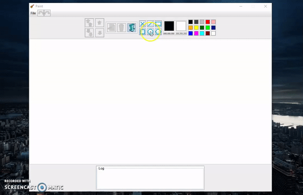

A simple MVC desktop app for drawing shapes, built using Java Swing.

Features: -Drawing,editing and deleting shapes -Saving drawings to local drive -Undo/redo actions -To front/to back actions -Log

Technologies/design patterns used in the application: MVC,Adapter,Command,Serialization,Prototype,Observer

Demo:

